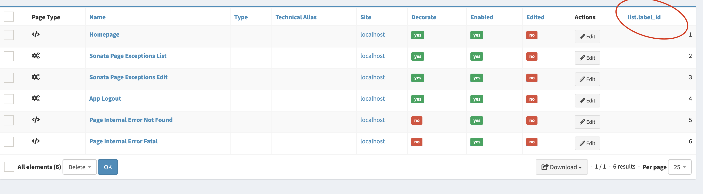
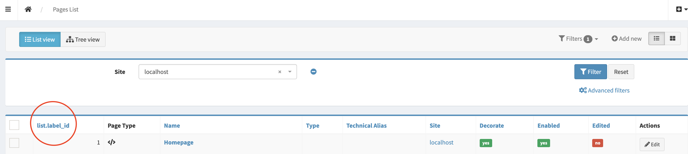

Customize admin
================

Sonata page bundle there are few admins that can be customize using `Admin Extension`_
As example if you want to add a new field in ``configureListFields``, You can do like this

.. code-block:: php

    namespace App\Admin\Extension;

    use Sonata\AdminBundle\Admin\AbstractAdminExtension;
    use Sonata\AdminBundle\Datagrid\ListMapper;
    use Symfony\Component\DependencyInjection\Attribute\AutoconfigureTag;

    #[AutoconfigureTag(name: 'sonata.admin.extension', attributes: ['target' => 'sonata.page.admin.page'])]
    class PageAdminExtension extends AbstractAdminExtension
    {
        public function configureListFields(ListMapper $list): void
        {
            $list->add('id');
        }
    }

And you will see the field in the end of the table

And for order the field to the begin of table you can use the method ``reorder``

.. code-block:: php

        public function configureListFields(ListMapper $list): void
        {
            $list->add('id');
            $list->reorder([
                'id',
            ]);
        }

.. note::

    To know more information about how to configure service tags using **yaml**, **xml** or **php** file check out in `Symfony Tags docs`_

List of admin
-------------

+------------------------+--------------------------------+
| Admin name             | target                         |
+========================+================================+
| Page Admin             | sonata.page.admin.page         |
+------------------------+--------------------------------+
| Block Admin            | sonata.page.admin.block        |
+------------------------+--------------------------------+
| Shared block Admin     | sonata.page.admin.shared_block |
+------------------------+--------------------------------+
| Snapshot Admin         | sonata.page.admin.snapshot     |
+------------------------+--------------------------------+
| Site Admin             | sonata.page.admin.site         |
+------------------------+--------------------------------+

.. _Admin Extension: https://docs.sonata-project.org/projects/SonataAdminBundle/en/4.x/reference/extensions/
.. _Symfony Tags docs: https://symfony.com/doc/current/service_container/tags.html